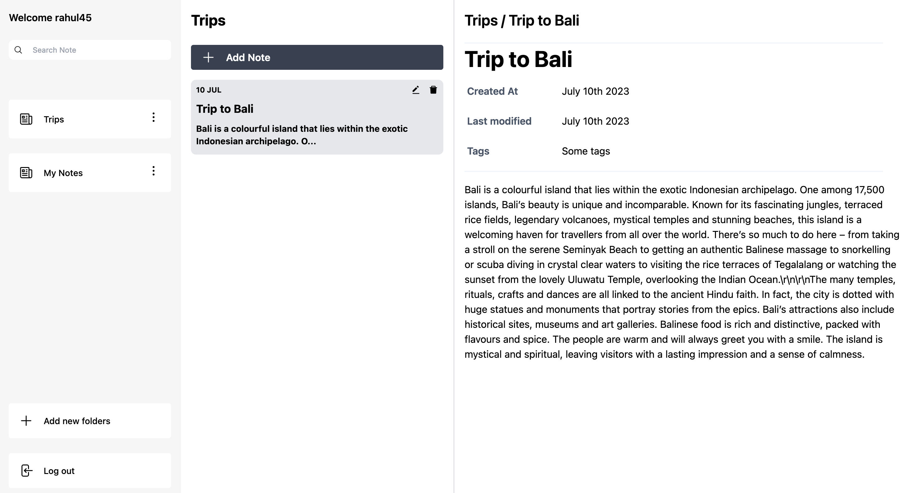

# Note Keep

> A simple note-taking application that allows users to create, view, edit, and delete notes. It provides a user-friendly interface for managing personal or project-related notes efficiently.

## Features

- Signup/Login: User can signup or login with user name, email & password.
- CRUD: User can create, read, update, delete notes created by them.
- Folders: User can categorize his notes into different folder ex: Journal, To-Do etc.

## Application preview

# Technologies used
- Front end
  - React.js
  - Redux
- Back end
  - Node.js
  - Express.js
  - MongoDB
